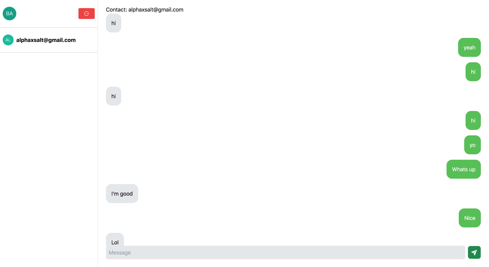

# Instant Messenger

Built with Typescript, React, NodeJS, graphql





## Pre-requisites
You'd need to grab the following environment variables for the server side
```
ENVIRONMENT
PORT
DB_PASS
DB_NAME

```


Client side uses AUth0 for authentication
First grab your Auth0 domain and clientId
Then grab the following environment variables for the client side
```
REACT_APP_API_URL
REACT_APP_WS_URL
REACT_APP_KEY
REACT_APP_AUTH_DOMAIN
REACT_APP_AUTH_CID
```

## Run locally
Install dependencies
```
yarn install-deps
```

Start server
```
yarn dev-server
```

Start client
```
yarn dev-client
```

## Build server and client for production
```
yarn build-server
```

```
yarn build client
```

